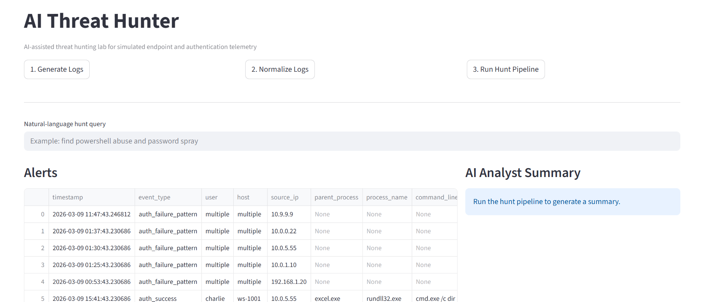
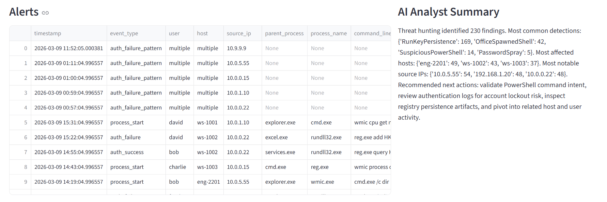

\# AI Threat Hunter

## Dashboard Preview



## Alerts and Analyst Summary



AI Threat Hunter is a Python and Streamlit cybersecurity portfolio project that simulates endpoint and authentication telemetry, normalizes event data, executes hunt-driven detection logic, and generates analyst-friendly findings.


\## Project Purpose


This project demonstrates how a threat hunter or SOC analyst can move from raw telemetry to actionable findings by combining:


\- synthetic event generation

\- log normalization

\- rule-based hunting logic

\- suspicious pattern detection

\- analyst-focused summaries

\- dashboard-based investigation


\## Features


\- Synthetic security log generation

\- Event normalization pipeline

\- Detection logic for:

&nbsp; - Suspicious PowerShell

&nbsp; - Password spray

&nbsp; - Registry Run key persistence

&nbsp; - Office spawning PowerShell or command shell

\- Natural-language hunt prompt matching

\- AI-style analyst summary

\- Streamlit dashboard for investigation


\## Project Structure


```text

ai-threat-hunter/

│   app.py

│   README.md

│   requirements.txt

│

├───data

├───docs

├───hunts

│       hunt\_prompts.yml

│

└───src

&nbsp;   └───ai\_threat\_hunter

&nbsp;       │   \_\_init\_\_.py

&nbsp;       │   config.py

&nbsp;       │   generator.py

&nbsp;       │   hunter.py

&nbsp;       │   normalizer.py

&nbsp;       │   summarizer.py

&nbsp;       │

&nbsp;       ├───detectors

&nbsp;       │       \_\_init\_\_.py

&nbsp;       │       rules.py

&nbsp;       │

&nbsp;       └───utils

&nbsp;               io.py

